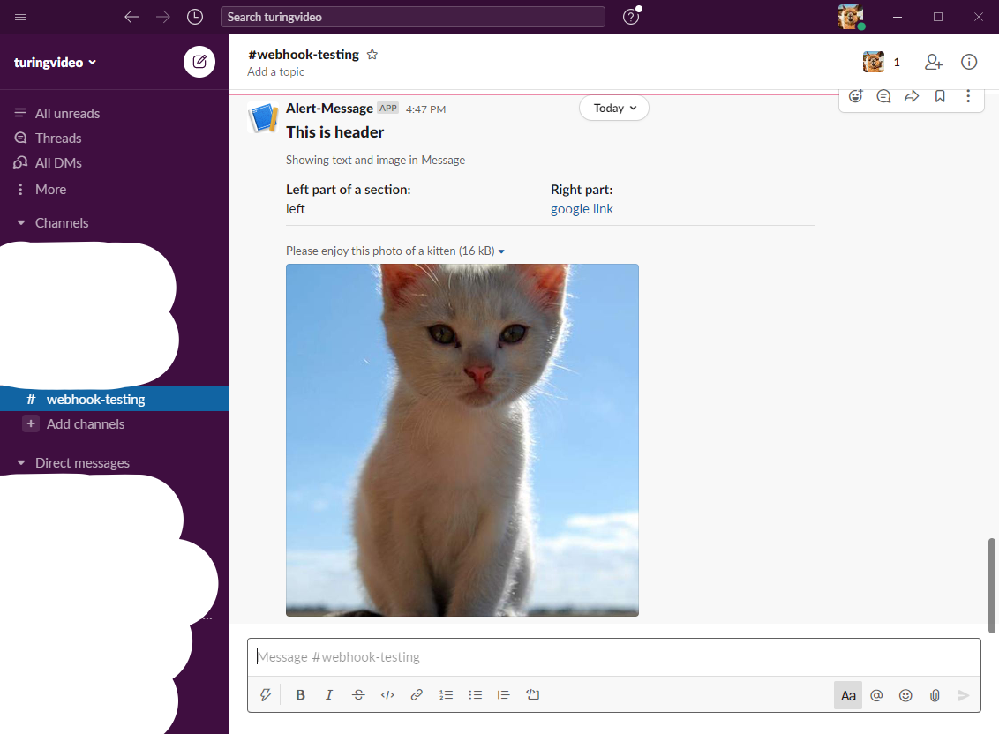

# Slack_Message

There are two ways to send messages to a slack channel, one is making an HTTP POST request to Incoming Webhook URL and another one is to utilize Slack API. Both has their advantages and disadvantages. 

|  | Webhook | Slack API |
|------|-------|-------------|
| Advantage| Easy to use and little to no code requirement. Developers only need to compose the POST payload based on the Slack's requirement and make the POST request. | Slack API offers developer more features to interact with Slack, such as uploading files. |
|Disadvantage| Features are limited by the supported POST request payload, webhook is mainly used for sending text and image* to slack channel. | Required more coding and cannot use tools, such as curl and Postman, to quickly test the result. |

\* image cannot be send along with the message, it has to be uploaded to an external storage and send the image_url along with the message.

In this README, we will focus on the webhook.

An payload example:
```java
{
  "blocks": [
    {
      "type": "header",
      "text": {
        "type": "plain_text",
        "text": "This is header"
      }
    },
    {
      "type": "context",
      "elements": [
        {
          "type": "plain_text",
          "text": "Showing text and image in Message"
        }
      ]
    },
    {
      "type": "section",
      "fields": [
        {
          "type": "mrkdwn",
          "text": "*Left part of a section:*\n left"
        },
        {
          "type": "mrkdwn",
          "text": "*Right part:*\n<https://google.com|google link>"
        }
      ]
    },
    {
      "type": "divider"
    },
    {
      "type": "image",
      "title": 
        {
          "type": "plain_text",
          "text": "Please enjoy this photo of a kitten"
        },
      "block_id": "image4",
      "image_url": "http://placekitten.com/500/500", 
      "alt_text": "An incredibly cute kitten."
    }
  ]
}
```
Slack Message:

 
